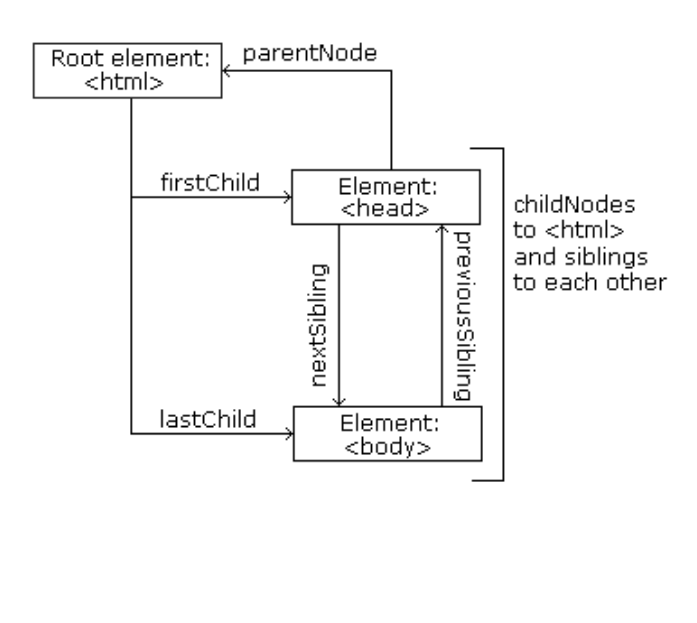

# WEEK 3.5

### Things we will cover in this week.

- DOM(Document Object Model)
- DOM representation of HTML document in memory
- APIs to create web contents and applications

### Episode Theory

- Standard for how to get, change, add or delete HTML elements
- JS makes the HTML page Active and dynamic via the DOM.

#### DOM

Read about DOM at [MDN WEB DOCS](https://developer.mozilla.org/en-US/docs/Web/API/Document_Object_Model/Introduction)

- Programming Interface for web documents.
- Represents the page so that programs can change the document structure, style and content.
- Tree like representation of the web page that gets loaded in the browser.
- DOM represents the document as nodes and objects.

##### Accessing the DOM

- You can begin using API for the document or window objects to manipulate the document itself.

###### Document Object

- Top most object in the DOM.
- Has properties and methods to get information about the document, using dot notation
- Some common methods are: 
1. createElement() method
2. innerText property
3. appendChild property
4. querySelectorAll
and so on...

###### Finding HTML elements

1. By ID
2. By tag name
3. By Class Name
4. By CSS Selectors
5. By HTML Object Collections(document.anchors, .body,.documentElement, .embeds, .forms, .head, .images, .links, .scripts, .title)

###### Changing HTML Elements

1. element.innerHTML property = new html content
2. element.attribute property = new value
3. element.style.property = new style
4. element.setAttribute(attribute, value)

###### Adding/Deleting Elements

1. document.createElement(element)
2. document.removeChild(element)
3. document.appendChild(element)
4. document.replaceChild(element)
5. document.write(text)

###### DOM Nodes

- Entire Document is a document node
- Every HTML element is an element node
- Text inside HTML elements are text nodes
- Every HTML attribute is an attribute node(Deprecated)
- All Comments are Comment nodes

###### Node Methods of Accessing

- node.childNodes – accesses the child nodes of a selected parent‌‌
- node.firstChild – accesses the first child of a selected parent‌‌
- node.lastChild – accesses the last child of a selected parent.‌‌
- node.parentNode – accesses the parent of a selected child node.‌‌
- node.nextSibling – accesses the next consecutive element (sibling) of a selected element.‌‌
- node.previousSibling – accesses the previous element (sibling) of a selected element.

###### DOM Events

- HTML DOM allows JavaScript to react to HTML events.
- onClick
- onLoad
- onUnload
and so on...

###### DOM EventListener
- Attaches an event handler to the specified element.
- Any number of event handlers can be added to one Element
- The addEventListener() method makes it easier to control how the event reacts to bubbling.
- You can easily remove an event listener by using the removeEventListener() method.

#### Event Bubbling or Event Capturing?
